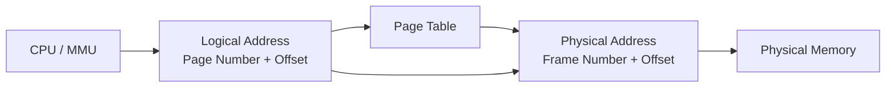
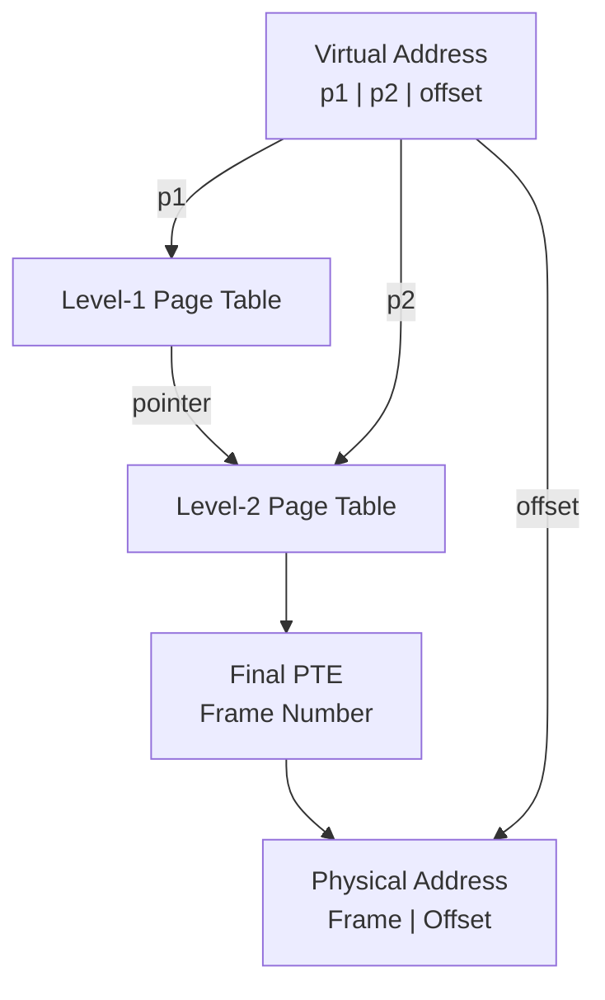
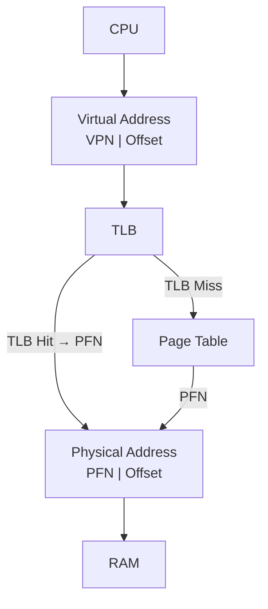
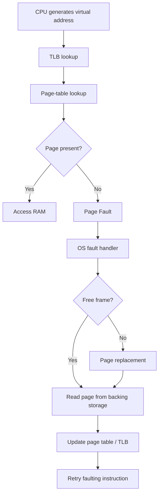

# Paging — GATE CSE Deep Notes

> **Primary source:** Go Classes lecture PDF `L-2(6).pdf` (150 pages).
>
> **Purpose:** Understand paging from first principles, then turn it into GATE-calculation patterns.
>
> **Important:** Sections marked **[Lecture]** are based directly on the uploaded lecture. Sections marked **[Extension]** add standard OS/GATE context from external references.

---

## 0. Big Picture

The entire paging story can be reduced to one problem:

> **A process generates a logical/virtual address, but RAM is addressed physically. How do we translate one into the other efficiently?**

The mental model:

```text
CPU
 │
 │ Logical / Virtual Address
 ▼
┌──────────────────────┐
│ Page Number | Offset │
└──────────────────────┘
          │
          │ page number
          ▼
     Page Table
          │
          │ frame number
          ▼
┌──────────────────────┐
│ Frame Number | Offset│
└──────────────────────┘
          │
          ▼
     Physical Memory
```

The **offset does not change**.

Only:

```text
Page Number  ──mapping──>  Frame Number
```

changes during translation.

The uploaded lecture introduces exactly this model: a logical address is divided into page number + offset, the page table maps the page to a frame, and the physical address is formed from frame number + the same offset. (Lecture pages 18–25, 46–54.)

---

# 1. Why Do We Need Paging?

## 1.1 A process thinks it owns a continuous memory space

When a program runs, it becomes a **process** with its own logical/virtual address space.

Typical process layout:

```text
High Address
┌─────────────────┐
│      Stack      │
│       ↓         │
├─────────────────┤
│                 │
│   Unused space  │
│                 │
├─────────────────┤
│       Heap      │
│       ↑         │
├─────────────────┤
│       Code      │
└─────────────────┘
Low Address
```

The lecture uses a tiny C program:

```c
main() {
    int a, *p;
    a = 5;
    p = malloc(4);
    *p = a;
}
```

The important observation is not the exact C syntax. It is that different parts of a process use different regions:

- code → code/text region
- local variable `a` → stack
- dynamically allocated memory pointed to by `p` → heap

The lecture shows this as the process's logical memory layout. (Lecture pages 4–10 and 21–22.)

---

## 1.2 Logical memory is not necessarily physically contiguous

Suppose a process sees:

```text
Logical / Virtual Memory

Page 0
Page 1
Page 2
Page 3
Page 4
...
```

RAM may look like:

```text
Physical Memory

Frame 0 → Page 3
Frame 1 → Page 0
Frame 2 → Page 4
Frame 3 → Page 1
...
```

The pages of one process do **not** need to occupy consecutive physical locations.

This is the key idea behind paging.

---

# 2. What Is Paging?

## Definition

> **Paging is a memory-management technique in which a process's logical address space is divided into fixed-size blocks called _pages_, while physical memory is divided into equal-size blocks called _frames_.**

The sizes are equal:

```text
Page size = Frame size
```

A page can therefore fit exactly into one frame.

The uploaded lecture explicitly introduces:

```text
Virtual / Logical Memory → Pages
Physical Memory           → Frames
```

and shows pages being mapped to arbitrary frames. (Lecture pages 15–20 and 24–25.)

---

# 3. Page vs Frame

| Logical / Virtual Memory | Physical Memory |
|---|---|
| divided into **pages** | divided into **frames** |
| page number | frame number |
| logical address | physical address |
| page size | frame size |
| same size | same size |

### Golden rule

> **Page size = Frame size**

Why?

Because a complete page must fit exactly into a physical frame.

---

# 4. The Page Table

If pages can be placed anywhere in RAM, the OS needs a mapping:

```text
Page Number → Frame Number
```

That mapping is stored in the **page table**.

Example:

| Page No. | Frame No. |
|---:|---:|
| 0 | 3 |
| 1 | 6 |
| 2 | 0 |
| 3 | 10 |
| ... | ... |
| 127 | 4 |

This is the same basic mapping shown in the lecture. (Lecture pages 25 and 48–50.)

### Mental model

Think of the page table as a lookup table:

```text
"I need Page 113."

        ↓

Page Table[113]

        ↓

Frame 10
```

Then the OS/MMU uses Frame 10 plus the original offset to form the physical address.

---

# 5. Logical Address Space vs Physical Address Space

## 5.1 Logical Address Space (LAS)

> **Logical address space is the range of addresses that a process can generate/use from its virtual view of memory.**

For an `n`-bit logical address:

\[
LAS = 2^n \text{ bytes}
\]

Example:

### 32-bit logical address

\[
LAS = 2^{32}\text{ bytes}=4\text{ GB}
\]

The lecture emphasizes that this is determined by the address width, not by how large the program actually is. A tiny process may still operate inside a much larger virtual address space. (Lecture page 23.)

---

## 5.2 Physical Address Space (PAS)

For an `m`-bit physical address:

\[
PAS = 2^m\text{ bytes}
\]

Example:

```text
32-bit logical address → up to 4 GB logical address space
30-bit physical address → 1 GB physical address space
```

They do not have to be equal.

### GATE trap

> **Logical address space can be larger than physical memory.**

Correct.

It can also be equal or smaller depending on the system.

---

# 6. Why Paging Helps

Suppose physical memory has one huge free block problem.

Without paging, allocating variable-sized regions can create **external fragmentation**.

Paging divides memory into fixed-size frames.

A page can be placed into **any free frame**.

Therefore:

- no need for one large contiguous physical region
- physical memory can be scattered
- allocation becomes easier

### Important distinction

Paging removes **external fragmentation** associated with variable-sized contiguous allocation, but introduces **internal fragmentation**.

---

# 7. Internal Fragmentation in Paging

Suppose:

```text
Page size = 4 KB
Process needs = 4001 KB
```

The process needs:

\[
\left\lceil \frac{4001}{4}\right\rceil=1001\text{ pages}
\]

Allocated:

\[
1001\times4=4004\text{ KB}
\]

Wasted:

\[
4004-4001=3\text{ KB}
\]

That unused space is inside the last allocated page.

Therefore:

> **Paging causes internal fragmentation, usually in the last page of an allocation.**

### Maximum internal fragmentation

For a single allocation:

\[
\boxed{\text{Maximum waste} = PageSize-1}
\]

Average waste under a simple uniform assumption:

\[
\boxed{\text{Average waste}\approx \frac{PageSize}{2}}
\]

---

# 8. Page Size

Page size is normally a power of two:

\[
PageSize=2^k\text{ bytes}
\]

Common exam values:

```text
1 KB = 2^10 bytes
2 KB = 2^11 bytes
4 KB = 2^12 bytes
8 KB = 2^13 bytes
16 KB = 2^14 bytes
```

### Why power of two?

Because it makes address splitting extremely simple.

If:

\[
PageSize=2^k
\]

then the **lowest k bits** of a logical address are the offset.

The remaining upper bits represent the page number.

---

# 9. Logical Address Structure

Suppose:

- logical address = `n` bits
- page size = \(2^k\) bytes

Then:

```text
Logical Address
┌──────────────────────┬───────────────┐
│     Page Number      │     Offset    │
│       n-k bits       │      k bits   │
└──────────────────────┴───────────────┘
```

This is one of the most important slides in the lecture. (Lecture pages 84–85 and 95.)

Therefore:

\[
\boxed{\text{Offset bits}=k}
\]

\[
\boxed{\text{Page-number bits}=n-k}
\]

---

# 10. Physical Address Structure

Suppose physical address size = `m` bits and page size = \(2^k\).

Then:

```text
Physical Address
┌──────────────────────┬───────────────┐
│     Frame Number     │     Offset    │
│       m-k bits       │      k bits   │
└──────────────────────┴───────────────┘
```

Therefore:

\[
\boxed{\text{Frame-number bits}=m-k}
\]

\[
\boxed{\text{Offset bits}=k}
\]

Notice:

> **Offset bits are identical in logical and physical addresses.**

The lecture explicitly highlights that the offset remains unchanged. (Lecture page 51.)

---

# 11. The Most Important Formula Set

Let:

- `n` = number of logical-address bits
- `m` = number of physical-address bits
- `PageSize = 2^k` bytes

Then:

### Logical address

\[
LA=(PageNumber,Offset)
\]

### Offset

\[
\boxed{Offset=LA\bmod PageSize}
\]

### Page number

\[
\boxed{PageNumber=\left\lfloor\frac{LA}{PageSize}\right\rfloor}
\]

### Physical address

If page `p` maps to frame `f`:

\[
\boxed{PA=FrameNumber\times PageSize+Offset}
\]

These are the core formulas repeatedly used throughout the lecture. (Lecture pages 37–54.)

---

# 12. Why Division Gives Page Number

Suppose:

```text
Page size = 16 bytes
```

Pages are:

```text
Page 0 → addresses 0–15
Page 1 → addresses 16–31
Page 2 → addresses 32–47
Page 3 → addresses 48–63
...
```

Take:

```text
LA = 31
```

Then:

\[
31/16=1\text{ remainder }15
\]

Therefore:

```text
Page number = 1
Offset      = 15
```

Why?

Because page 1 starts at address 16, and 31 is 15 bytes into that page.

---

# 13. Address Range of a Page

For page number `p` and page size `S`:

### Starting address

\[
\boxed{Start=p\times S}
\]

### Ending address

\[
\boxed{End=(p+1)S-1}
\]

### Number of bytes

\[
\boxed{S}
\]

Example:

```text
Page size = 16 bytes
Page number = 10
```

Start:

\[
10\times16=160
\]

End:

\[
11\times16-1=175
\]

So:

```text
Page 10 → addresses 160–175
```

This exact style of question appears in the lecture. (Lecture pages 41–45.)

---

# 14. Which Address Belongs to Which Page?

For any logical address `LA`:

\[
\boxed{Page=\left\lfloor LA/PageSize\right\rfloor}
\]

Example:

```text
Page size = 16 bytes
LA = 130
```

\[
130/16=8\text{ remainder }2
\]

Therefore:

```text
Page = 8
Offset = 2
```

Address range of page 8:

```text
128–143
```

So 130 is inside page 8.

---

# 15. Offset Formula

\[
\boxed{Offset=LA\bmod PageSize}
\]

Example:

```text
LA = 130
Page size = 16
```

\[
130\bmod16=2
\]

Therefore:

```text
Offset = 2
```

### Binary shortcut

If:

\[
PageSize=2^k
\]

then:

> **Last k bits = offset**

No division/modulo calculation is needed.

---

# 16. Binary Address Splitting

Suppose:

```text
Logical address = 16 bits
Page size = 4 KB = 2^12 bytes
```

Therefore:

```text
Offset = 12 bits
Page number = 16 - 12 = 4 bits
```

Address:

```text
0000 0111 0010 0100
^^^^
page

        ^^^^^^^^^^^^
           offset
```

So:

```text
Page number = upper 4 bits
Offset      = lower 12 bits
```

The lecture demonstrates exactly this idea using a 16-bit address and 4-KB pages. (Lecture pages 78–81.)

---

# 17. Binary Division Shortcut

Suppose:

\[
N/2^p
\]

For a binary number:

```text
N = b(k-1)...b(p) | b(p-1)...b(0)
```

Then:

```text
left part  = quotient
right part = remainder
```

In other words:

\[
\boxed{\text{Divide by }2^p \Rightarrow \text{right shift by }p}
\]

and

\[
\boxed{\text{Remainder}=\text{last }p\text{ bits}}
\]

The lecture explicitly uses this shortcut. (Lecture pages 60–76.)

---

# 18. Example: Binary Page Number + Offset

Given:

```text
Logical address = 7538
Page size = 16 = 2^4
```

Convert:

```text
7538 = 1110 1011 0010₂
```

Split last 4 bits:

```text
1110 1011 | 0010
   ↑          ↑
quotient    remainder
```

Therefore:

```text
Page number = 1110 1011₂ = 235
Offset      = 0010₂ = 2
```

Same result as:

\[
7538/16=235\text{ remainder }2
\]

The lecture uses this example to establish the binary shortcut. (Lecture pages 72–75.)

---

# 19. Number of Pages in a Logical Address Space

If:

```text
Logical address size = n bits
Page size = 2^k bytes
```

then:

\[
LAS=2^n
\]

and:

\[
PageSize=2^k
\]

Therefore:

\[
\boxed{NumberOfPages=\frac{2^n}{2^k}=2^{n-k}}
\]

This is one of the highest-frequency GATE formulas.

### Example

```text
LAS = 2^32 bytes
Page size = 4 KB = 2^12 bytes
```

\[
NumberOfPages=2^{32-12}=2^{20}
\]

---

# 20. Number of Frames in Physical Memory

If:

```text
Physical address = m bits
Page/frame size = 2^k bytes
```

then:

\[
PAS=2^m
\]

and:

\[
\boxed{NumberOfFrames=2^{m-k}}
\]

### Example

```text
Physical address = 30 bits
Page size = 4 KB = 2^12
```

\[
Frames=2^{30-12}=2^{18}
\]

---

# 21. Maximum Pages in Memory at One Time

If a process has:

```text
8 logical pages
5 physical frames
```

then at most:

\[
\boxed{5\text{ pages}}
\]

can be physically resident at once.

Why?

Because:

```text
1 frame holds 1 page
```

and there are only 5 frames.

The lecture includes this conceptual question. (Lecture page 29.)

### Important

Number of virtual pages:

```text
8
```

Number that can be resident simultaneously:

```text
≤ 5
```

---

# 22. Logical vs Physical Memory Size

Never assume:

```text
LAS = Physical Memory
```

They are different concepts.

Example:

```text
Logical address = 32 bits
Physical address = 30 bits
```

Then:

\[
LAS=2^{32}\text{ bytes}=4\text{ GB}
\]

\[
PAS=2^{30}\text{ bytes}=1\text{ GB}
\]

So:

```text
Virtual space = 4 GB
Physical memory addressable = 1 GB
```

The lecture explicitly asks this conceptual trap. (Lecture page 30.)

---

# 23. Page Table Size

This is a **major GATE topic**.

A single-level page table has:

\[
\boxed{\text{One PTE per virtual page}}
\]

Therefore:

\[
\boxed{\text{Number of PTEs}=\text{Number of virtual pages}}
\]

So:

\[
\boxed{PTSize=NumberOfPages\times PTESize}
\]

If:

- logical address = `n` bits
- page size = \(2^k\)
- PTE size = `E` bytes

then:

\[
\boxed{PTSize=2^{n-k}\times E}
\]

---

# 24. Page Table Size Example

Given:

```text
Logical address = 32 bits
Page size = 4 KB = 2^12 bytes
PTE size = 4 bytes = 2^2 bytes
```

Number of pages:

\[
2^{32-12}=2^{20}
\]

Page table size:

\[
2^{20}\times2^2=2^{22}\text{ bytes}
\]

Since:

\[
2^{22}\text{ bytes}=4\text{ MB}
\]

Therefore:

\[
\boxed{PTSize=4\text{ MB}}
\]

The lecture explicitly demonstrates this calculation. (Lecture pages 87–88, 99–101.)

---

# 25. Why a Tiny Process Can Have a Huge Page Table

This is one of the most important conceptual points.

Suppose:

```text
32-bit virtual address
4 KB pages
4-byte PTE
```

Then every process potentially has:

\[
2^{20}
\]

virtual pages.

So the page table is:

\[
2^{20}\times4=4\text{ MB}
\]

Now imagine a tiny program using only ~35 bytes of actual memory.

The lecture illustrates this contrast:

```text
Actual process memory ≈ 35 bytes
Page table           ≈ 4 MB
```

That is enormous overhead compared with the program itself. (Lecture pages 127–130.)

### Why?

Because a flat page table reserves an entry for **every possible virtual page**, even if most pages are unused.

---

# 26. The Unused Virtual Address Space Problem

A typical process may look like:

```text
Code
Heap
-----------------------
Unused virtual space
-----------------------
Stack
```

The unused middle region can be enormous.

A flat page table still has entries corresponding to those virtual pages.

Many entries will therefore be invalid/null.

The lecture visually shows this as a page table containing many invalid entries. (Lecture pages 131–134.)

This motivates:

> **Multi-level paging**

---

# 27. Page Table Entry (PTE)

A PTE is not necessarily just:

```text
Frame number
```

It may also contain control/status bits.

The lecture lists:

- frame number
- valid bit
- protection bit
- present bit
- referenced bit
- dirty bit

(Lecture pages 104–106.)

---

# 28. Important PTE Bits

## 28.1 Valid bit

Indicates whether the entry represents a valid mapping.

Conceptually:

```text
Valid = 1 → mapping is valid
Valid = 0 → entry is invalid
```

An invalid entry may represent an unused virtual page.

---

## 28.2 Present bit

Indicates whether the page is currently resident in physical memory.

Conceptually:

```text
Present = 1 → page is in RAM
Present = 0 → page is not currently in RAM
```

If a referenced page is not present, the system may generate a **page fault**.

> **Do not blindly treat `valid` and `present` as identical.**
>
> Their exact semantics depend on the architecture/OS. In GATE-style questions, use the meaning explicitly provided.

---

## 28.3 Protection bits

Control allowed operations.

Typical permissions:

```text
R → Read
W → Write
X → Execute
```

Example:

```text
Code page → R-X
Data page → R-W
```

---

## 28.4 Referenced / Accessed bit

Indicates that the page has been accessed.

Useful for page replacement algorithms.

---

## 28.5 Dirty / Modified bit

Indicates that the page has been modified.

If a dirty page is evicted, its modified contents may need to be written back to backing storage.

---

# 29. PTE Size from Address Bits

A very common GATE pattern:

```text
Physical address = m bits
Page size = 2^k bytes
```

Then:

\[
\boxed{\text{Frame number bits}=m-k}
\]

At minimum, the PTE needs enough bits to store the frame number.

So:

\[
\boxed{PTESize\ge \frac{m-k}{8}\text{ bytes}}
\]

If additional control bits are required, add them.

---

# 30. Example: PTE Bit Calculation

Suppose:

```text
Physical address = 30 bits
Page size = 4 KB = 2^12 bytes
```

Then:

```text
Offset = 12 bits
Frame number = 30 - 12 = 18 bits
```

So the PTE needs at least:

```text
18 bits
```

for the frame number.

If the question says:

```text
PTE size = 32 bits
```

then:

\[
32-18=14
\]

bits remain for:

```text
valid/protection/present/referenced/dirty/other metadata
```

The lecture uses this exact style of reasoning in the GATE questions around pages 109–112.

---

# 31. PTE Example with a 32-bit PTE

Suppose:

```text
PTE = 32 bits
Physical address = 30 bits
Page size = 4 KB
```

Physical address:

```text
┌──────────────────┬────────────┐
│ Frame = 18 bits  │ Offset=12  │
└──────────────────┴────────────┘
```

Therefore:

```text
PTE:
┌──────────────────┬──────────────┐
│ Frame No. 18 bits│ Other 14 bits│
└──────────────────┴──────────────┘
```

The remaining 14 bits can encode metadata.

---

# 32. Complete Logical → Physical Translation

Suppose:

```text
Page size = S
Logical address = LA
```

### Step 1: Find page number

\[
p=\left\lfloor\frac{LA}{S}\right\rfloor
\]

### Step 2: Find offset

\[
d=LA\bmod S
\]

### Step 3: Look up page table

\[
PageTable[p]=f
\]

### Step 4: Construct physical address

\[
\boxed{PA=fS+d}
\]

Mental pipeline:

```text
LA
│
├── page number ──> Page Table ──> frame number
│
└── offset ────────────────────────────────┐
                                           │
Frame number + same offset ────────────────┘
                    ↓
              Physical Address
```

---

# 33. Worked Example: Physical Address

Given:

```text
Page size = 8 bytes
Logical address = 905
Page table:
Page 113 → Frame 10
```

### Step 1

\[
905/8=113\text{ remainder }1
\]

Therefore:

```text
Page = 113
Offset = 1
```

### Step 2

From page table:

```text
Page 113 → Frame 10
```

### Step 3

\[
PA=(10\times8)+1
\]

\[
\boxed{PA=81}
\]

This exact example appears in the lecture. (Lecture pages 47–51.)

---

# 34. Another Worked Example

Given:

```text
Page size = 64 bytes
Logical address = 810

Page table:
11 → 15
12 → 13
13 → 10
```

### Step 1: Page number

\[
810/64=12\text{ remainder }42
\]

So:

```text
Page = 12
Offset = 42
```

### Step 2

```text
Page 12 → Frame 13
```

### Step 3

\[
PA=(13\times64)+42
\]

\[
=832+42
\]

\[
\boxed{PA=874}
\]

The lecture works through this example on pages 52–54.

---

# 35. GATE 2024 Example Pattern

Given:

```text
Page size = 2 KB = 2048 bytes

Virtual address = 2500

Mapping:
Page 0 → Frame 1
Page 1 → Frame 3
Page 2 → Frame 2
Page 3 → Frame 0
```

### Step 1

\[
2500/2048=1\text{ remainder }452
\]

So:

```text
Page = 1
Offset = 452
```

### Step 2

```text
Page 1 → Frame 3
```

### Step 3

\[
PA=(3\times2048)+452
\]

\[
=6144+452
\]

\[
\boxed{6596}
\]

The lecture identifies this as the GATE CSE 2024 Set 1 question. (Lecture pages 57–59.)

---

# 36. Page Number + Offset Directly from Bits

If:

```text
Logical address = n bits
Page size = 2^k bytes
```

then:

```text
┌──────────────────────────────┬──────────────┐
│ Page number = n-k bits      │ Offset = k   │
└──────────────────────────────┴──────────────┘
```

This is often faster than decimal arithmetic.

### Example

```text
20-bit address
Page size = 4 KB = 2^12
```

Therefore:

```text
Page number = 20 - 12 = 8 bits
Offset       = 12 bits
```

Number of pages:

\[
2^8=256
\]

---

# 37. Constructing a Logical Address

Suppose:

```text
20-bit logical address
Page size = 4 KB
Page number = 00101101₂
Offset = 0001 0100 0010₂
```

Since 4 KB = \(2^{12}\):

```text
Page number → 8 bits
Offset      → 12 bits
```

So:

```text
Logical Address =
00101101 | 000101000010
```

The lecture uses this construction pattern around page 89.

---

# 38. Finding the Beginning of the Next Page

If the current logical address is inside a page and you want the first address of the next page:

### Method 1

Find current page:

\[
p=\left\lfloor LA/S\right\rfloor
\]

Next page starts at:

\[
\boxed{(p+1)S}
\]

### Method 2 — binary

If page size is \(2^k\), set all lower `k` bits to zero and increment the page number.

Example:

```text
Page size = 1 KB = 2^10
```

If:

```text
LA = [page bits][offset bits]
```

then beginning of next page is:

```text
[next page bits][0000000000]
```

The lecture demonstrates this using a 16-bit address and 1-KB pages. (Lecture pages 90–91.)

---

# 39. Physical Address Bit Structure

Let:

```text
Logical address = n bits
Physical address = m bits
Page size = 2^k
```

Then:

```text
Virtual:
┌───────────────┬────────────┐
│ n-k page bits │ k offset   │
└───────────────┴────────────┘

Physical:
┌───────────────┬────────────┐
│ m-k frame bits│ k offset   │
└───────────────┴────────────┘
```

Notice:

```text
logical page bits ≠ physical frame bits
```

but:

```text
logical offset = physical offset
```

---

# 40. Number of Page-Table Entries

For a flat/single-level page table:

\[
\boxed{\#PTE=\#VirtualPages}
\]

Therefore:

\[
\boxed{\#PTE=2^{n-k}}
\]

where:

- `n` = logical address bits
- `k` = page-offset bits

---

# 41. Page Table Size Formula — Master Form

\[
\boxed{
PTSize
=
2^{n-k}\times PTESize
}
\]

If PTE size is \(2^e\) bytes:

\[
\boxed{
PTSize=2^{n-k+e}\text{ bytes}
}
\]

This formula should be memorized only after understanding why:

```text
number of pages × size of each PTE
```

---

# 42. GATE 2015-Style Page Table Calculation

Given:

```text
Logical address = 32 bits
Page size = 4 KB = 2^12 bytes
PTE = 4 bytes = 2^2 bytes
```

Number of pages:

\[
2^{32-12}=2^{20}
\]

Page table:

\[
2^{20}\times2^2
=
2^{22}\text{ bytes}
=
4\text{ MB}
\]

The uploaded lecture shows this as a GATE CSE 2015 question. (Lecture pages 99–100.)

---

# 43. GATE 2016-Style PTE Calculation

Suppose:

```text
Virtual address = 40 bits
Physical address = 30 bits
Page size = 16 KB = 2^14 bytes
PTE size = 48 bits
```

Virtual address:

```text
40 bits
```

Offset:

```text
14 bits
```

Virtual page number:

\[
40-14=26
\]

Number of pages:

\[
2^{26}
\]

Each PTE = 48 bits = 6 bytes.

Therefore:

\[
PTSize=2^{26}\times6
\]

\[
=384\text{ MB}
\]

The lecture shows this GATE-style calculation around pages 102–103.

---

# 44. Physical Memory → Number of Frames

Given:

```text
Physical memory = 64 MB
Page size = 4 KB
```

Convert:

\[
64MB=2^{26}\text{ bytes}
\]

\[
4KB=2^{12}\text{ bytes}
\]

Therefore:

\[
Frames=\frac{2^{26}}{2^{12}}
\]

\[
\boxed{Frames=2^{14}}
\]

---

# 45. PTE Size Can Be Bigger Than the Frame Number

Suppose:

```text
Physical memory = 64 MB = 2^26 bytes
Page size = 4 KB = 2^12
```

Frames:

\[
2^{26-12}=2^{14}
\]

So frame number needs:

\[
14\text{ bits}
\]

If a PTE is 16 bits:

```text
14 bits → frame number
2 bits  → other information
```

If PTE is 32 bits:

```text
14 bits → frame number
18 bits → metadata
```

### Trap

> PTE size is **not automatically equal** to the number of frame-number bits.

PTE may contain many additional bits.

---

# 46. Page Table Storage Itself Uses Memory

A page table is not magical hardware that consumes zero memory.

In typical systems, page tables occupy memory.

Therefore:

```text
Process memory
+
Page table memory
=
actual memory overhead
```

This becomes a serious problem when:

- virtual address space is huge
- page size is small
- process uses only a tiny fraction of the address space

This motivates hierarchical/multi-level page tables.

---

# 47. The Central Problem with Flat Page Tables

Suppose:

```text
32-bit virtual address
4 KB pages
4-byte PTE
```

Then:

```text
Number of pages = 2^20
Page table = 2^20 × 4 bytes
           = 4 MB
```

Now imagine the process uses:

```text
Code → a few pages
Heap → a few pages
Stack → a few pages
```

The huge middle region may be unused.

Yet the flat table has entries for it.

This is wasteful.

The lecture explicitly uses the process example where actual memory usage is tiny compared with the 4-MB page table. (Lecture pages 127–134.)

---

# 48. Multi-Level Paging

> **Multi-level paging divides a large page table into smaller page tables arranged hierarchically.**

Instead of:

```text
One giant page table
```

we use:

```text
Level 1
   │
   ├── Level 2 table
   ├── Level 2 table
   └── Level 2 table
          │
          └── actual PTEs
```

The key optimization:

> **Only the portions of the hierarchy corresponding to used virtual-address regions need to exist.**

This is the core idea presented in the lecture pages 135–150 and also in standard OS references.

---

# 49. Why Multi-Level Paging Saves Memory

Imagine:

```text
Virtual space

Code
Heap
--------------------
Huge unused region
--------------------
Stack
```

Flat page table:

```text
[valid][valid][valid][invalid][invalid][invalid]...[valid][valid]
```

The invalid entries still consume page-table space.

Multi-level:

```text
Root
 ├── Code region table
 ├── Heap region table
 └── Stack region table

(no lower-level tables for giant unused gaps)
```

So:

\[
\boxed{\text{Unused virtual regions do not require lower-level page tables}}
\]

This is the main reason multi-level paging is useful.

---

# 50. Multi-Level Paging as a Tree

Think of a multi-level page table as a tree.

```text
                    Root
                     │
          ┌──────────┼──────────┐
          ▼          ▼          ▼
        Table A    Table B    Table C
          │                     │
       ┌──┼──┐                ┌─┼─┐
       ▼  ▼  ▼                ▼ ▼ ▼
      PTE PTE PTE             PTE PTE PTE
```

A virtual address provides the indices needed to walk this tree.

---

# 51. Two-Level Paging

For a 32-bit address with:

```text
10-bit first-level index
10-bit second-level index
12-bit offset
```

the address becomes:

```text
┌──────────┬──────────┬────────────┐
│    p1    │    p2    │   offset   │
│ 10 bits  │ 10 bits  │  12 bits   │
└──────────┴──────────┴────────────┘
```

Translation:

```text
p1
 │
 ▼
Level-1 page table
 │
 │ gives address of L2 table
 ▼
p2
 │
 ▼
Level-2 page table
 │
 │ gives frame number
 ▼
frame + offset
 │
 ▼
physical address
```

This structure is standard two-level/hierarchical paging. The lecture motivates the technique on pages 135–150; external OS references describe the same hierarchy.

---

# 52. Multi-Level Paging Translation Algorithm

Given virtual address:

```text
[p1 | p2 | ... | offset]
```

### Step 1

Use `p1` to index level-1 table.

### Step 2

The entry gives the location of a lower-level page table.

### Step 3

Use `p2` to index that table.

### Step 4

Continue until the final-level PTE.

### Step 5

Read the frame number.

### Step 6

Append the unchanged offset.

Result:

```text
Physical address = [frame number | offset]
```

---

# 53. Why "Page the Page Table"?

This phrase is worth understanding.

Normal paging:

```text
Process memory → pages
Physical memory → frames
```

Multi-level paging effectively applies paging-like organization to the page table itself:

```text
Huge flat page table
        ↓
split into smaller pieces
        ↓
allocate only needed pieces
```

That is why hierarchical paging can be thought of as **paging the page table**.

---

# 54. Important Misconception: Can We Always Store the Flat Page Table Directly?

Yes — if the system is willing to pay the memory cost.

The lecture makes an important point:

> Multi-level paging is not mandatory merely because a flat page table is 4 MB.

If the page table is 4 MB and RAM is 4 GB, a flat 4-MB page table can physically fit.

The problem is **wasted memory due to unused entries**, not simply "4 MB is larger than RAM."

The lecture explicitly calls this a major misconception on pages 146–150.

### Therefore

```text
"Page table = 4 MB"
        ≠
"Cannot store page table"
```

Instead:

```text
4-MB flat page table
        ↓
Can fit in 4-GB RAM
        ↓
But may waste memory because most entries can be unused
        ↓
Multi-level paging reduces this waste
```

---

# 55. Very Important: Multi-Level Paging Is NOT Magic Compression

Suppose:

```text
Flat page table = 4 MB
```

You cannot simply say:

```text
"Split it into 4 smaller tables, so total = 1 MB."
```

That is wrong.

The purpose is:

> **Do not allocate lower-level tables for unused portions of the virtual address space.**

If every virtual page is actually used, multi-level paging may not save much and can even add overhead.

---

# 56. Paging Translation and the MMU

The **MMU (Memory Management Unit)** performs address translation.

Conceptually:

```text
CPU generates virtual address
          │
          ▼
        MMU
          │
          ├── page number
          │       ↓
          │   page table
          │       ↓
          │   frame number
          │
          └── offset unchanged
                  ↓
          physical address
```

The uploaded lecture's diagram shows this logical-to-physical translation path. (Lecture pages 86 and 97.)

---

# 57. Translation Lookaside Buffer (TLB) — [Extension]

> **TLB = Translation Lookaside Buffer**

The page table is useful but accessing it from memory for every address translation adds overhead.

The TLB is a small, fast cache of recent page-to-frame translations.

Think:

```text
Page Table = large database
TLB        = tiny hot-cache of recent mappings
```

A TLB entry conceptually stores:

```text
Virtual Page Number → Physical Frame Number
```

---

# 58. Why Do We Need a TLB?

Without TLB:

```text
CPU
 │
 │ virtual address
 ▼
Page Table in memory
 │
 │ frame number
 ▼
Physical memory
```

A memory reference may require:

1. accessing the page table
2. accessing the actual data/instruction

So paging can introduce an extra memory access.

With TLB:

```text
CPU
 │
 ▼
TLB
 │
 ├── hit → frame immediately
 │
 └── miss → page table lookup
```

The TLB avoids many page-table memory accesses.

---

# 59. TLB Hit

Suppose:

```text
Virtual page = 5
Offset = 100
```

TLB contains:

```text
Page 5 → Frame 12
```

Then:

```text
TLB hit
```

Physical address:

\[
PA=12\times PageSize+100
\]

No page-table memory lookup is needed for the translation.

---

# 60. TLB Miss

If:

```text
Virtual page = 5
```

but TLB does not contain page 5:

```text
TLB miss
```

Then the system consults the page table.

Conceptually:

```text
Virtual address
      │
      ▼
     TLB
      │
   miss
      ▼
  Page Table
      │
      ▼
Frame number
      │
      ▼
Physical address
```

The mapping may then be inserted into the TLB.

---

# 61. TLB Hit vs Page Fault

Do not confuse them.

### TLB miss

Means:

> Translation was not found in the TLB.

It does **not automatically mean** the page is absent from RAM.

### Page fault

Means:

> The required page is not currently resident in physical memory / the required page-table state indicates it cannot be directly accessed as present.

So:

```text
TLB miss
   ↓
Page table lookup
   ↓
Page may be present
   OR
Page may not be present → page fault
```

This distinction is a classic exam trap.

---

# 62. TLB and Page Table

Think of them as two levels of the same translation information:

```text
                Translation
                     │
          ┌──────────┴──────────┐
          ▼                     ▼
        TLB                  Page Table
   small + fast            large + slower
   recent entries           full mapping
```

The TLB is **not a replacement for the page table**.

It is a cache of page-table information.

---

# 63. Effective Access Time with TLB — [Extension]

Suppose:

- TLB lookup time = `t`
- memory access time = `m`
- TLB hit ratio = `α`

Simplified model:

### TLB hit

\[
t+m
\]

### TLB miss

\[
t+2m
\]

because:

```text
TLB lookup
+ page table memory access
+ actual memory access
```

Therefore:

\[
\boxed{
EAT=\alpha(t+m)+(1-\alpha)(t+2m)
}
\]

Simplify:

\[
\boxed{
EAT=t+(2-\alpha)m
}
\]

### Warning

Some GATE questions define the timing model differently. Always read whether TLB lookup overlaps with memory access or whether the page-table lookup is already included.

---

# 64. TLB Associativity — [Extension]

A TLB is typically implemented as associative/associative-cache-like hardware.

Conceptually:

```text
VPN
 │
 ▼
Compare against many TLB tags
 │
 ├── match → PFN
 └── no match → TLB miss
```

This allows fast lookup without scanning entries one by one.

The IIT Madras OS material describes the TLB as an address-translation cache and notes that TLB entries are searched associatively.

---

# 65. Page Fault — [Extension]

If a page is referenced but is not resident in physical memory:

```text
CPU
 ↓
Virtual address
 ↓
Translation
 ↓
Page not present
 ↓
Page fault
 ↓
OS handles fault
 ↓
Load page into a frame
 ↓
Update page table
 ↓
Retry instruction
```

If no free frame exists:

```text
Page replacement
       ↓
Choose victim page
       ↓
Possibly write dirty victim to disk
       ↓
Load required page
       ↓
Update page table
       ↓
Retry
```

This connects paging to **virtual memory** and **page replacement**.

---

# 66. Page Table + TLB + Page Fault: Full Picture

```text
                    CPU
                     │
              Virtual Address
                     │
                     ▼
                    TLB
                 /       \
              hit         miss
               │             │
               │             ▼
               │        Page Table
               │             │
               │       ┌─────┴─────┐
               │       │           │
               │    present      absent
               │       │           │
               │       │        Page Fault
               │       │           │
               │       │       OS loads page
               │       │           │
               │       └─────┬─────┘
               │             │
               └─────────────┘
                     │
                Frame + Offset
                     │
                     ▼
               Physical Memory
```

---

# 67. Page Table vs TLB vs Cache

These are different.

| Structure | Main purpose |
|---|---|
| Page table | complete virtual-page → physical-frame mapping |
| TLB | cache recent page translations |
| CPU cache | cache recently used data/instructions |
| RAM | physical memory |
| Backing storage | holds pages that are not currently resident |

### Classic trap

> TLB is **not** the same thing as CPU cache.

The TLB caches **address translations**, not ordinary program data.

---

# 68. Single-Level Paging vs Multi-Level Paging

| Feature | Single-level | Multi-level |
|---|---|---|
| Structure | one large table | hierarchy of tables |
| Lookup | simple | multiple levels |
| Table allocation | potentially entire table | lower tables can be allocated on demand |
| Memory overhead | high for sparse address spaces | lower for sparse address spaces |
| Translation complexity | lower | higher |
| Extra memory references | fewer | potentially more |
| Main motivation | simplicity | reduce page-table memory |

---

# 69. When Multi-Level Paging Helps Most

Multi-level paging is especially useful when:

```text
Virtual address space is huge
AND
Process uses only small/disconnected regions
```

Example:

```text
Code     → used
Heap     → used
Middle   → mostly unused
Stack    → used
```

This creates a sparse virtual address space.

Multi-level page tables avoid allocating lower-level page tables for the unused middle.

---

# 70. When Multi-Level Paging Saves Little

If the process uses nearly the entire virtual address space:

```text
Code
Data
Heap
...
...
Stack
```

then most page-table entries are valid.

Multi-level paging may no longer save much memory because many lower-level tables are required.

---

# 71. Page Table Memory vs Process Memory

A very important GATE intuition:

> **Page-table size depends primarily on the virtual address space and page size, not directly on the amount of memory actually used by the process.**

For a flat page table:

\[
PTSize=
\frac{VirtualAddressSpace}{PageSize}
\times PTESize
\]

Therefore, even a tiny process can have a large flat page table.

---

# 72. Page Size Trade-Off

Page size affects several things simultaneously.

## Larger page size

Advantages:

- fewer pages
- fewer PTEs
- smaller page table
- fewer translation entries required

Disadvantages:

- more internal fragmentation
- each page transfer may move more data
- potentially less fine-grained memory management

## Smaller page size

Advantages:

- less internal fragmentation
- finer-grained allocation

Disadvantages:

- more pages
- larger page tables
- potentially more translation overhead

### GATE mental model

```text
Page size ↑
   ↓
#pages ↓
   ↓
Page-table size ↓

But

Page size ↑
   ↓
Internal fragmentation ↑
```

---

# 73. Relationship Web

This is worth remembering as a dependency graph.

```text
Logical Address Bits (n)
             │
             ├──────────────┐
             │              │
             ▼              ▼
      Logical Space     Page Number Bits
        = 2^n             = n-k
                            │
                            ▼
                       # Pages = 2^(n-k)
                            │
                            ▼
                     # PTEs (flat PT)
                            │
                            ▼
                  Page Table Size
```

And:

```text
Page Size = 2^k
     │
     ├── Offset bits = k
     ├── Internal fragmentation
     └── Number of pages = LAS / PageSize
```

Physical side:

```text
Physical Address Bits = m
          │
          ▼
Physical Space = 2^m
          │
          ▼
Frames = 2^(m-k)
          │
          ▼
Frame-number bits = m-k
```

---

# 74. GATE Formula Sheet

## Address-space formulas

\[
\boxed{LAS=2^n\text{ bytes}}
\]

\[
\boxed{PAS=2^m\text{ bytes}}
\]

---

## Page/frame formulas

\[
\boxed{PageSize=FrameSize}
\]

\[
\boxed{PageSize=2^k}
\]

\[
\boxed{\#Pages=\frac{LAS}{PageSize}=2^{n-k}}
\]

\[
\boxed{\#Frames=\frac{PAS}{PageSize}=2^{m-k}}
\]

---

## Address decomposition

\[
\boxed{PageNumber=\left\lfloor\frac{LA}{PageSize}\right\rfloor}
\]

\[
\boxed{Offset=LA\bmod PageSize}
\]

\[
\boxed{FrameNumber=PageTable[PageNumber]}
\]

\[
\boxed{PA=FrameNumber\times PageSize+Offset}
\]

---

## Bit decomposition

If page size is \(2^k\):

\[
\boxed{OffsetBits=k}
\]

\[
\boxed{PageNumberBits=n-k}
\]

\[
\boxed{FrameNumberBits=m-k}
\]

---

## Page table

\[
\boxed{\#PTE=\#Pages}
\]

\[
\boxed{PTSize=\#Pages\times PTESize}
\]

\[
\boxed{PTSize=2^{n-k}\times PTESize}
\]

---

## PTE frame bits

\[
\boxed{FrameBits=m-k}
\]

---

# 75. GATE Question Triggers

When you see:

### "Which page contains address X?"

Immediately think:

\[
X/PageSize
\]

---

### "What is the offset?"

Immediately think:

\[
X\bmod PageSize
\]

or:

> last `k` bits if page size = \(2^k\)

---

### "How many pages?"

Immediately think:

\[
LAS/PageSize
\]

---

### "How many frames?"

Immediately think:

\[
PhysicalMemory/PageSize
\]

---

### "Page table size?"

Immediately think:

```text
#pages × PTE size
```

---

### "How many bits for page number?"

Immediately think:

```text
logical-address bits − offset bits
```

---

### "How many bits for frame number?"

Immediately think:

```text
physical-address bits − offset bits
```

---

### "Physical address?"

Immediately think:

```text
page number
→ page table
→ frame number
→ frame × page size + offset
```

---

### "Why multi-level paging?"

Immediately think:

```text
Huge sparse virtual address space
→ flat page table has many invalid entries
→ split table hierarchically
→ allocate only needed lower-level tables
```

---

# 76. Common GATE Traps

## Trap 1

> Page number = `LA mod PageSize`

❌ Wrong.

Correct:

\[
PageNumber=\lfloor LA/PageSize\rfloor
\]

---

## Trap 2

> Offset = `LA / PageSize`

❌ Wrong.

Correct:

\[
Offset=LA\bmod PageSize
\]

---

## Trap 3

> Page size and frame size are different.

❌ In ordinary paging, they are equal.

---

## Trap 4

> Logical memory must fit entirely into physical memory.

❌ False.

Virtual/logical address space can be larger than physical memory.

---

## Trap 5

> Every virtual page must be present in RAM.

❌ False in virtual-memory systems.

---

## Trap 6

> TLB miss = page fault.

❌ False.

A TLB miss only means the translation was not found in the TLB.

---

## Trap 7

> PTE contains only the frame number.

❌ Not necessarily.

It can also contain:

```text
valid
present
protection
referenced/accessed
dirty
other architecture-specific bits
```

---

## Trap 8

> Multi-level paging always reduces total memory usage.

❌ Not necessarily.

It is beneficial especially when the virtual address space is sparse.

---

## Trap 9

> A 4-MB page table cannot fit in 4-GB RAM.

❌ False.

4 MB easily fits in 4 GB.

The issue is whether allocating that table is wasteful.

---

## Trap 10

> Page table size depends directly on process size.

❌ Not for a flat page table.

It depends primarily on:

```text
virtual address space
page size
PTE size
```

---

# 77. Fast Mental Arithmetic for GATE

Convert powers first.

```text
1 KB  = 2^10
2 KB  = 2^11
4 KB  = 2^12
8 KB  = 2^13
16 KB = 2^14

1 MB  = 2^20
1 GB  = 2^30
```

Then subtract exponents.

Example:

```text
32-bit address
4 KB pages
```

Think:

```text
32 - 12 = 20
```

So:

```text
20 page bits
12 offset bits
2^20 pages
```

---

# 78. Binary Shortcut Table

| Operation | Binary shortcut |
|---|---|
| divide by \(2^k\) | right shift `k` |
| remainder mod \(2^k\) | last `k` bits |
| multiply by \(2^k\) | left shift `k` |
| page offset for \(2^k\)-byte pages | last `k` bits |
| page number | upper bits |

This is especially useful for numerical GATE questions.

---

# 79. One Complete Example From Scratch

Given:

```text
Logical address = 16 bits
Physical address = 20 bits
Page size = 1 KB
PTE size = 4 bytes
```

## Step 1: Page size

\[
1KB=2^{10}
\]

Therefore:

```text
offset = 10 bits
```

## Step 2: Page-number bits

\[
16-10=6
\]

Therefore:

```text
Page number = 6 bits
```

## Step 3: Number of pages

\[
2^6=64
\]

## Step 4: Number of frames

Physical address = 20 bits:

\[
2^{20}/2^{10}=2^{10}
\]

Therefore:

```text
1024 frames
```

## Step 5: Frame number bits

\[
20-10=10
\]

## Step 6: Page table size

\[
64\times4=256\text{ bytes}
\]

So:

```text
Virtual address:
[6-bit page][10-bit offset]

Physical address:
[10-bit frame][10-bit offset]
```

---

# 80. Another Complete Example

Given:

```text
Logical address = 32 bits
Physical address = 30 bits
Page size = 4 KB
PTE size = 4 bytes
```

### Offset bits

\[
4KB=2^{12}
\]

\[
Offset=12
\]

### Virtual page bits

\[
32-12=20
\]

### Number of pages

\[
2^{20}
\]

### Physical frame bits

\[
30-12=18
\]

### Number of frames

\[
2^{18}
\]

### Page table size

\[
2^{20}\times4
=
2^{22}
=
4MB
\]

Final:

```text
Logical address:
20-bit page number + 12-bit offset

Physical address:
18-bit frame number + 12-bit offset

#Pages:
2^20

#Frames:
2^18

Flat page table:
4 MB
```

---

# 81. Source-Lecture Question Patterns

The uploaded lecture repeatedly trains these exact patterns:

1. LAS and page size → number of pages.
2. Logical address → page number + offset.
3. Page number + page table → frame number.
4. Frame number + offset → physical address.
5. Logical/physical address width → page/frame bit counts.
6. Number of pages × PTE size → page table size.
7. PTE width − frame-number bits → remaining metadata bits.
8. Tiny process vs huge flat page table → motivation for multi-level paging.
9. Binary division by \(2^k\) → upper bits quotient, lower `k` bits remainder.
10. Page table sparsity → hierarchical paging.

These patterns cover the numerical core of the lecture.

---

# 82. Visual Reference Images

The following external diagrams were selected because they reinforce the same concepts as the lecture.

## Basic page-table translation


Source: Wikimedia Commons, `PageTable.png`.

---

## TLB translation


Source: Wikimedia Commons, `TLB.svg`.

---

## Paging + TLB flow


Source: Wikimedia Commons, `Steps In a Translation Lookaside Buffer.png`.

---

## Page-table layout


Source: Wikimedia Commons, `Paging graphic.svg`.

---

# 83. Obsidian-Friendly Mermaid Diagram

If external images are unavailable, Obsidian can render this:



The important conceptual point:

```text
Page number changes into frame number.
Offset passes through unchanged.
```

---

# 84. Multi-Level Paging Mermaid Diagram



---

# 85. TLB Mermaid Diagram



---

# 86. Page Fault Mermaid Diagram



---

# 87. Deep Intuition: Why the Offset Never Changes

Imagine a page as a box containing exactly `S` bytes.

```text
Page 5:

offset 0
offset 1
offset 2
...
offset S-1
```

Suppose Page 5 is stored in Frame 12.

We do not rearrange the bytes inside the page.

Therefore:

```text
Page 5, offset 17
```

becomes:

```text
Frame 12, offset 17
```

Only the **container identity** changes:

```text
page → frame
```

The position inside the container stays:

```text
offset → same offset
```

That is the deepest intuition behind:

\[
PA=Frame\times PageSize+Offset
\]

---

# 88. Deep Intuition: Why Paging Eliminates External Fragmentation

Without paging:

```text
[used][free  ][used][free][used]
```

A new large object may need one large contiguous free block.

With paging:

```text
Physical memory:
[frame][frame][frame][frame][frame]...
```

A process's pages can occupy scattered frames:

```text
Process:
Page 0 → Frame 7
Page 1 → Frame 2
Page 2 → Frame 13
Page 3 → Frame 4
```

No contiguous physical region is required.

---

# 89. Deep Intuition: Why Page Tables Become Large

Suppose:

```text
Virtual address = 32 bits
Page size = 4 KB
```

A 4-KB page contains:

\[
2^{12}
\]

bytes.

The virtual address space contains:

\[
2^{32}
\]

bytes.

Therefore:

\[
2^{32}/2^{12}=2^{20}
\]

virtual pages.

Even if the process uses only 10 pages, the flat page table potentially needs:

```text
2^20 entries
```

because it must be able to map every virtual page.

That is the root cause of the page-table-size problem.

---

# 90. Deep Intuition: Multi-Level Paging as a Sparse Tree

Instead of allocating:

```text
2^20 entries
```

immediately, imagine a tree.

The root divides the virtual address space into regions.

Only if a region is actually used do we create the next-level table.

So:

```text
Unused region
   ↓
No lower-level table
   ↓
No need to allocate thousands of invalid PTEs
```

This is exactly why multi-level paging is useful for sparse address spaces.

---

# 91. GATE Revision: 30-Second Recall

If you have only 30 seconds before a question:

```text
Page = virtual block
Frame = physical block
Page size = Frame size

LA = Page No + Offset
PA = Frame No + Offset

Page No = LA / PageSize
Offset  = LA % PageSize

PA = Frame × PageSize + Offset

If PageSize = 2^k:
    offset = last k bits
    page bits = n-k
    frame bits = m-k

#Pages  = LAS / PageSize
#Frames = PAS / PageSize

Flat Page Table:
#PTE = #Pages
PT size = #Pages × PTE size

TLB = cache of translations

TLB miss ≠ page fault

Multi-level paging:
avoid allocating page-table parts for unused virtual regions
```

---

# 92. Final Mental Model

Do not memorize paging as isolated formulas.

Visualize this:

```text
              VIRTUAL WORLD
                   │
                   │
             Virtual Address
                   │
          ┌────────┴────────┐
          │                 │
      Page Number        Offset
          │                 │
          ▼                 │
      Page Table             │
          │                 │
          ▼                 │
      Frame Number           │
          │                 │
          └────────┬────────┘
                   │
                   ▼
             Physical Address
                   │
                   ▼
                RAM
```

Everything else is an optimization or extension:

```text
Page Table
   ↓
too many accesses
   ↓
TLB

Flat Page Table
   ↓
too much unused metadata
   ↓
Multi-Level Paging

Page not resident
   ↓
Page Fault
   ↓
Virtual Memory / Replacement
```

That is the connected picture.

---

# 93. External References Used for Expansion

- Wikimedia Commons — Page-table translation diagram.
- Wikimedia Commons — TLB diagrams.
- Cambridge Operating Systems material — TLB operation.
- IIT Madras Operating Systems notes — TLB as address-translation cache.
- OpenOS textbook — multi-level page tables.
- Standard OS memory-management references for paging, page faults, and page-table organization.

The diagrams above are chosen from sources with reusable licensing where possible; check the source page if redistributing the images outside your personal Obsidian vault.

---

# 94. Lecture Coverage Map

Useful places in the uploaded lecture:

| Topic | Lecture pages |
|---|---:|
| Paging intuition | 2–20 |
| Process logical memory | 21–24 |
| Logical vs physical memory | 23–30 |
| Pages and frames | 15–20 |
| Page number / offset | 31–46 |
| Physical address calculation | 47–58 |
| Binary shortcut | 60–76 |
| Bit-level address splitting | 78–97 |
| Page-table size | 87–103 |
| PTE fields | 104–112 |
| PTE/frame-bit calculations | 109–126 |
| Tiny-process/page-table problem | 127–134 |
| Multi-level paging | 135–150 |

---

# 95. The Three Equations to Never Forget

If everything else disappears, retain these:

\[
\boxed{
PageNumber=\left\lfloor\frac{LogicalAddress}{PageSize}\right\rfloor
}
\]

\[
\boxed{
Offset=LogicalAddress\bmod PageSize
}
\]

\[
\boxed{
PhysicalAddress=(FrameNumber\times PageSize)+Offset
}
\]

And remember how the frame number is obtained:

\[
\boxed{
FrameNumber=PageTable[PageNumber]
}
\]

So the complete chain is:

\[
\boxed{
LA
\rightarrow
(Page,Offset)
\rightarrow
PageTable
\rightarrow
(Frame,Offset)
\rightarrow
PA
}
\]

