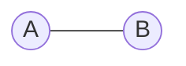
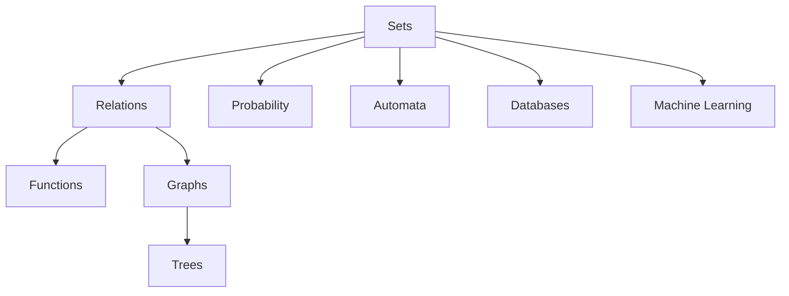

# Module 1 — Sets

> [!info] Why Learn Sets First?
> Every topic in **Discrete Mathematics** is built upon the concept of **Sets**.
>
> Sets → Relations → Functions → Graphs → Probability → Automata → Databases
>
> Almost every topic in Computer Science can be viewed as a **collection of objects with rules**.

---

# 1. Introduction to Sets

## 1.1 Definition

A **Set** is a **well-defined collection of distinct objects**.

### 1.1.1 Keywords

- **Well-defined** → Everyone should agree whether an object belongs to the set.
- **Distinct** → Duplicate elements are ignored.
- **Unordered** → The order of elements does not matter.

---

### 1.1.2 Example

```text
A = {1,2,3}

Same as

A = {3,2,1}

Same as

A = {1,2,2,3,3}
```

> [!note]
> A set ignores:
>
> - Order
> - Duplicate elements

---

# 2. Membership

Membership tells whether an element belongs to a set.

Notation

$$
\in
$$

means **belongs to**

$$
\notin
$$

means **does not belong to**

---

## Example

Let

$$
A=\{1,2,3\}
$$

Then

$$
1\in A
$$

because **1 is an element of A**.

Similarly,

$$
4\notin A
$$

because **4 is not present in A**.

---

# 3. Representation of Sets

Sets can be represented in two ways.

---

## 3.1 Roster (Tabular) Form

List every element of the set.

### Example

$$
A=\{2,4,6,8\}
$$

---

## 3.2 Set Builder Form

Describe the set using a rule.

### Example

$$
A=\{x\mid x\text{ is even and }x<10\}
$$

Read as

> Set of all **x** such that **x is even** and **x is less than 10**.

---

# 4. Types of Sets

| Type | Description | Example |
|------|-------------|---------|
| Empty Set | No elements | $\varnothing$ |
| Singleton Set | Exactly one element | {7} |
| Finite Set | Limited elements | {1,2,3} |
| Infinite Set | Unlimited elements | $\mathbb N$ |
| Equal Sets | Same elements | {1,2}={2,1} |
| Equivalent Sets | Same number of elements | {1,2,3} and {a,b,c} |

---

## 4.1 Empty Set

Notation

$$
\varnothing
$$

or

$$
\{\}
$$

### Example

Students aged **300 years**.

Such students do not exist.

Hence,

$$
\varnothing
$$

---

## 4.2 Universal Set

The **Universal Set** contains **every element under discussion**.

Notation

$$
U
$$

### Example

Suppose we are discussing only numbers from **1 to 10**.

Then

$$
U=\{1,2,3,4,5,6,7,8,9,10\}
$$

Now let

$$
A=\{2,4,6,8,10\}
$$

Every element of A belongs to U.

Therefore,

$$
A\subseteq U
$$

> [!important]
> The Universal Set depends on the problem.
>
> It may be
>
> - Natural Numbers $(\mathbb N)$
> - Integers $(\mathbb Z)$
> - Real Numbers $(\mathbb R)$
> - Students in a class
> - Employees in a company

---

# 5. Cardinality

Cardinality means

> Number of elements in a set.

Notation

$$
|A|
$$

### Example

Let

$$
A=\{2,5,9\}
$$

The set contains three elements.

Therefore,

$$
|A|=3
$$

---

# 6. Subsets

A set **A** is a subset of **B** if every element of A also belongs to B.

Notation

$$
A\subseteq B
$$

---

## Example

Let

$$
A=\{1,2\}
$$

$$
B=\{1,2,3\}
$$

Every element of A exists in B.

Therefore,

$$
A\subseteq B
$$

However,

$$
B\nsubseteq A
$$

because **3 is not present in A**.

---

## 6.1 Proper Subset

Notation

$$
A\subset B
$$

A is inside B but A is **not equal** to B.

---

## 6.2 Important Facts

> [!important]

- Every set is a subset of itself.

$$
A\subseteq A
$$

- Empty set is a subset of every set.

$$
\varnothing\subseteq A
$$

---

# 7. Set Operations

## 7.1 Union

Union contains **every unique element** present in either set.

Notation

$$
A\cup B
$$

### Example

Let

$$
A=\{1,2,3\}
$$

$$
B=\{3,4,5\}
$$

Then

$$
A\cup B=\{1,2,3,4,5\}
$$

---

## 7.2 Intersection

Intersection contains only the **common elements**.

Notation

$$
A\cap B
$$

### Example

Let

$$
A=\{1,2,3\}
$$

$$
B=\{2,3,5\}
$$

The common elements are

2 and 3.

Therefore,

$$
A\cap B=\{2,3\}
$$

---

## 7.3 Difference

Difference contains elements present in the first set but not in the second.

Notation

$$
A-B
$$

### Example

Let

$$
A=\{1,2,3\}
$$

$$
B=\{2,4\}
$$

Remove elements of B from A.

Only

1 and 3 remain.

Therefore,

$$
A-B=\{1,3\}
$$

---

## 7.4 Complement

Complement contains every element of the Universal Set that is **not** in A.

Notation

$$
A'
$$

### Example

Let

$$
U=\{1,2,3,4,5,6\}
$$

$$
A=\{2,4,6\}
$$

Then

$$
A'=\{1,3,5\}
$$

---

## 7.5 Disjoint Sets

Two sets are called **Disjoint Sets** if they have **no common elements**.

$$
A\cap B=\varnothing
$$

### Example

Let

$$
A=\{1,2,3\}
$$

$$
B=\{4,5,6\}
$$

There are no common elements.

Therefore,

$$
A\cap B=\varnothing
$$

Hence,

A and B are **Disjoint Sets**.

---

# 8. Venn Diagrams

A **Venn Diagram** is a graphical representation of sets.



Interpretation

- Entire region of both circles → **Union**
- Common overlapping region → **Intersection**
- Area outside A (inside Universal Set) → **Complement**
- Two circles with no overlap → **Disjoint Sets**

---

# 9. Power Set

The **Power Set** is the set containing **all possible subsets** of a set.

Notation

$$
P(A)
$$

---

## Example

Let

$$
A=\{a,b\}
$$

All possible subsets are

$$
\varnothing,\{a\},\{b\},\{a,b\}
$$

Therefore,

$$
P(A)=
\{
\varnothing,
\{a\},
\{b\},
\{a,b\}
\}
$$

---

## 9.1 Formula

If

$$
|A|=n
$$

then

$$
|P(A)|=2^n
$$

> [!tip]
> Every element has two choices:
>
> - Include
> - Exclude
>
> Hence,
>
> $$
> 2^n
> $$

---

# 10. Cartesian Product

The Cartesian Product forms **ordered pairs**.

Notation

$$
A\times B
$$

---

## Example

Let

$$
A=\{1,2\}
$$

and

$$
B=\{x,y\}
$$

Pair every element of A with every element of B.

Therefore,

$$
A\times B=
\{
(1,x),
(1,y),
(2,x),
(2,y)
\}
$$

> [!important]
> The **first element** of every ordered pair comes from **A**.
>
> The **second element** comes from **B**.

---

## 10.1 Formula

If

$$
|A|=m
$$

and

$$
|B|=n
$$

then

$$
|A\times B|=m\times n
$$

> [!warning]
> Ordered pairs are **not sets**.
>
> $$
> (1,x)\neq(x,1)
> $$

---

# 11. Sets in Computer Science



---

# 12. GATE Shortcuts

> [!tip]

- Sets ignore order.
- Sets ignore duplicates.
- Every set is a subset of itself.
- Empty set is a subset of every set.
- Power Set contains all subsets.
- Cartesian Product forms ordered pairs.

---

# 13. Common Mistakes

> [!warning]

### 13.1 Order Matters?

$$
\{1,2\}=\{2,1\}
$$

Both sets are identical.

---

### 13.2 Ordered Pair vs Set

$$
(1,2)\neq\{1,2\}
$$

An ordered pair is **not** a set.

---

### 13.3 Power Set

Power Set means **all subsets**, not all combinations.

---

# 14. Revision Summary

- Set
- Membership
- Representation
- Types of Sets
- Universal Set
- Cardinality
- Subsets
- Set Operations
- Venn Diagrams
- Power Set
- Cartesian Product

---

# 15. Formula Sheet

$$
|P(A)|=2^n
$$

$$
|A\times B|=|A|\times|B|
$$

$$
A\cap B=\varnothing
\Longrightarrow
A,B
\text{ are Disjoint}
$$

---

# 16. Next Module

➡️ [[Relations]]