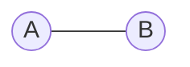
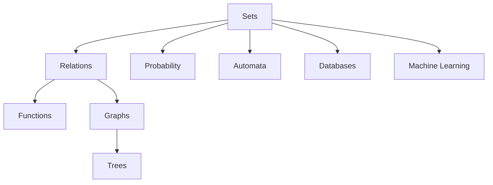

# Module 1 — Sets

> [!info] Why Learn Sets First?
> Every topic in **Discrete Mathematics** is built upon the concept of sets.
>
> Relations → Functions → Graphs → Probability → Automata → Databases
>
> All of them are essentially **collections of objects with rules**.

---

# 1. Introduction to Sets

## 1.1 Definition

A **set** is a **well-defined collection of distinct objects**.

### 1.1.1 Keywords

- **Well-defined** → Everyone agrees whether an object belongs.
- **Distinct** → Duplicate elements are ignored.
- **Unordered** → Position of elements does not matter.

### 1.1.2 Example

```text
A = {1,2,3}

Same as

A = {3,2,1}

Same as

A = {1,2,2,3,3}
```

> [!note]
> Sets ignore:
>
> - Order
> - Duplicate elements

---

# 2. Membership

If

$$
A=\{1,2,3\}
$$

Then

$$
1\in A
$$

means **1 belongs to A**

and

$$
4\notin A
$$

means **4 does not belong to A**

---

# 3. Representing Sets

## 3.1 Roster Form

List every element.

Example

$$
A=\{2,4,6,8\}
$$

---

## 3.2 Set Builder Form

Describe a rule.

$$
A=\{x \mid x \text{ is even and } x<10\}
$$

Read as

> Set of all **x** such that **x is even** and **x is less than 10**.

---

# 4. Types of Sets

| Type | Description | Example |
|------|-------------|---------|
| Empty Set | No elements | $\varnothing$ |
| Singleton | One element | {7} |
| Finite | Limited elements | {1,2,3} |
| Infinite | Unlimited elements | $\mathbb N$ |
| Equal | Same elements | {1,2}={2,1} |
| Equivalent | Same size | {1,2,3} and {a,b,c} |

---

## 4.1 Empty Set

Notation

$$
\varnothing
$$

or

$$
\{\}
$$

Example

Students aged **300 years**

No such student exists.

Therefore

$$
\varnothing
$$

---

## 4.2 Universal Set

The **Universal Set** represents everything under discussion.

Example

$$
U=\{1,2,\dots,10\}
$$

---

# 5. Cardinality

Cardinality means

> Number of elements inside a set.

Notation

$$
|A|
$$

Example

$$
A=\{2,5,9\}
$$

Then

$$
|A|=3
$$

---

# 6. Subsets

A set **A** is a subset of **B** if every element of **A** exists in **B**.

Notation

$$
A\subseteq B
$$

Example

$$
A=\{1,2\}
$$

$$
B=\{1,2,3\}
$$

Therefore

$$
A\subseteq B
$$

---

## 6.1 Proper Subset

Notation

$$
A\subset B
$$

Meaning

- A is inside B
- A is NOT equal to B

---

## 6.2 Important Facts

> [!important]

- Every set is a subset of itself.
- Empty set is a subset of every set.

---

# 7. Set Operations

## 7.1 Union

Everything present in either set.

$$
A\cup B
$$

Example

$$
A=\{1,2,3\}
$$

$$
B=\{3,4,5\}
$$

$$
A\cup B=\{1,2,3,4,5\}
$$

---

## 7.2 Intersection

Common elements only.

$$
A\cap B
$$

Example

$$
A\cap B=\{2,3\}
$$

---

## 7.3 Difference

$$
A-B
$$

Example

$$
A-B=\{1,3\}
$$

---

## 7.4 Complement

Everything outside A but inside the Universal Set.

$$
A'
$$

---

## 7.5 Disjoint Sets

Two sets are **disjoint** if

$$
A\cap B=\varnothing
$$

---

# 8. Venn Diagrams



Interpretation

- Entire region → Union
- Overlap → Intersection
- Outside → Complement

---

# 9. Power Set

The **Power Set** is the set containing **all subsets**.

Notation

$$
P(A)
$$

Example

$$
P(A)=
\{
\varnothing,
\{a\},
\{b\},
\{a,b\}
\}
$$

---

## 9.1 Formula

$$
|P(A)|=2^n
$$

> [!tip]
> Every element has two choices:
>
> - Include
> - Exclude
>
> Hence
>
> $$
> 2^n
> $$

---

# 10. Cartesian Product

Forms **ordered pairs**.

Notation

$$
A\times B
$$

Example

$$
A\times B
=
\{
(1,x),
(1,y),
(2,x),
(2,y)
\}
$$

---

## 10.1 Formula

$$
|A\times B|
=
|A|\times|B|
$$

> [!warning]
> Ordered pairs are **not** sets.
>
> $$
> (1,x)\neq(x,1)
> $$

---

# 11. Sets in Computer Science



---

# 12. GATE Shortcuts

> [!tip]

- Sets ignore order.
- Sets ignore duplicates.
- Empty set is a subset of every set.
- Every set is a subset of itself.
- Power Set contains all subsets.
- Cartesian Product creates ordered pairs.

---

# 13. Common Mistakes

> [!warning]

### 13.1 Order Matters?

❌

$$
\{1,2\}\neq\{2,1\}
$$

False.

They are identical.

---

### 13.2 Ordered Pair vs Set

❌

$$
(1,2)=\{1,2\}
$$

False.

---

### 13.3 Power Set

Power Set means **all subsets**, not all combinations.

---

# 14. Revision Summary

- Set
- Membership
- Roster Form
- Set Builder Form
- Empty Set
- Universal Set
- Cardinality
- Subset
- Proper Subset
- Union
- Intersection
- Difference
- Complement
- Disjoint Sets
- Power Set
- Cartesian Product

---

# 15. GATE Formula Sheet

$$
|P(A)|=2^n
$$

$$
|A\times B|=|A|\times|B|
$$

$$
A\cap B=\varnothing
\Longrightarrow
A,B
\text{ are disjoint}
$$

---

# 16. Next Module

➡️ [[Relations]]